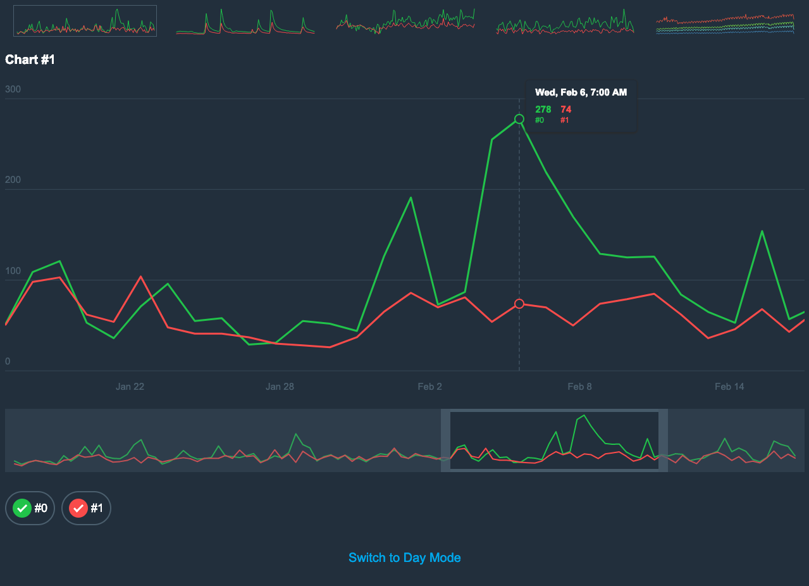

# Telegram Contest Chart Application

The application was made for the 2019 March - April Coding Competition by [Telegram](https://telegram.org/).
The goal was to develop a software for showing simple charts based on the provided input.

See the [demo](http://dronkin.ru/telegram-contest-chart/).

## About

The application written on pure JavaScript without usage of any 3th-party libraries.
The source code is ECMAScript 2018 which then transpiled to ECMAScript 2015, so the target browser must support it as well.
Also the source code is annotated for [Closure Compiler](https://developers.google.com/closure/compiler/) to produce a bundle with the minimum possible size.

## Features

* Line, Bar and Area chart types;
* Dual Y axis;
* Flexible layout;
* Zooming and panning;
* Nice ticks formatting;
* Day and night themes;
* Legend and cursor;
* Touch devices support;
* Retina displays support;
* Smooth transition for datasets changing and Y axis scaling;
* Responsive - every chart on the page will be redrawn on resize or orientation change;

## Development

`npm run dev` - starts the development server;  
`npm run build` - builds a bundle;  
`npm run lint` - lint the code;
